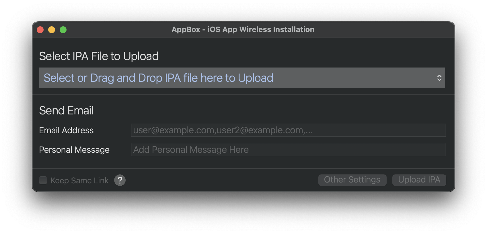
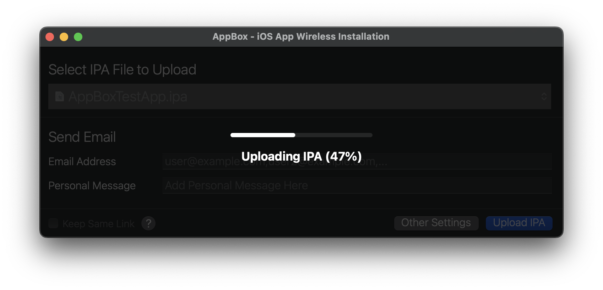
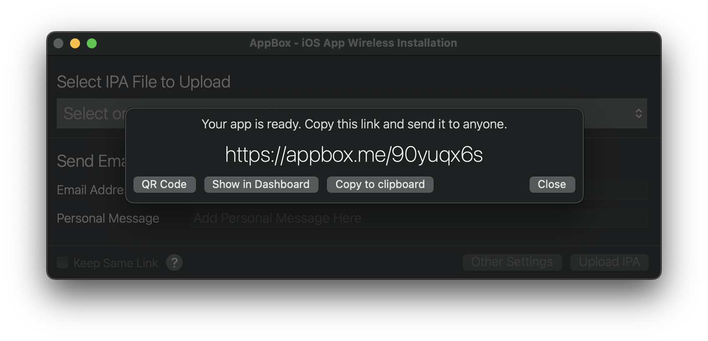
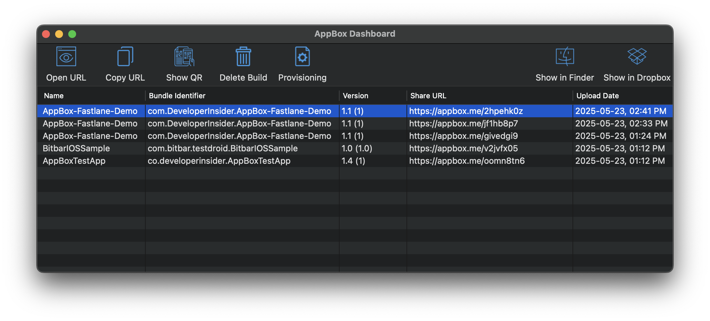
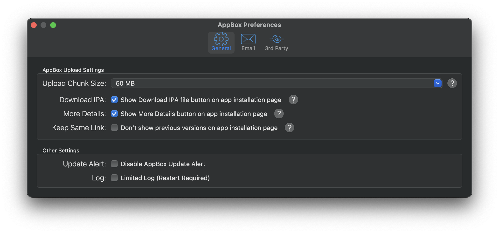
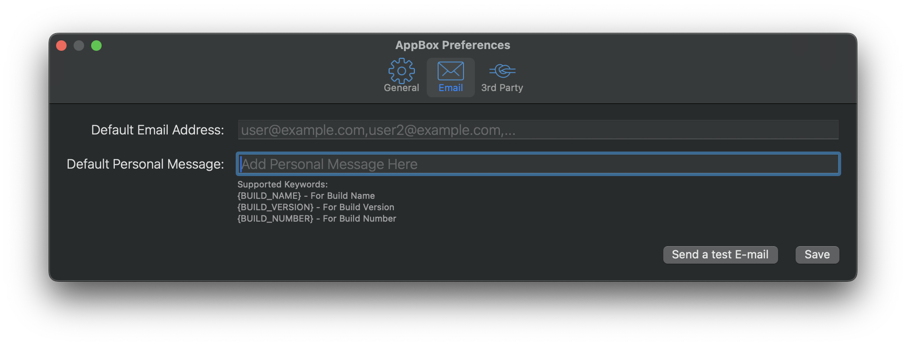
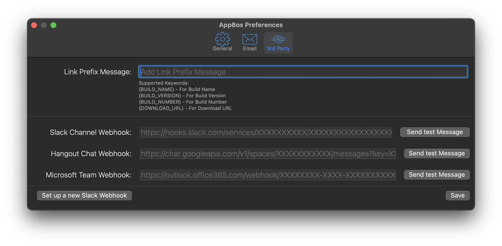
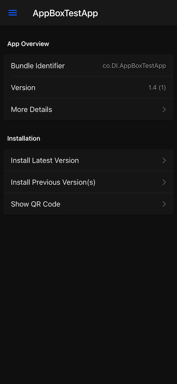
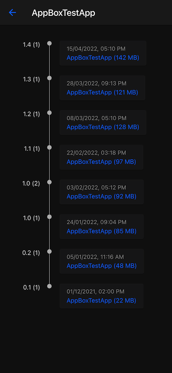

[](https://github.com/sponsors/vineetchoudhary)
[](https://github.com/vineetchoudhary/AppBox-iOSAppsWirelessInstallation/releases/latest)
[](https://getappbox.com/download)
[](#user-content-license)
[](https://twitter.com/AppBoxHQ)

# AppBox - iOS Apps Wireless Installation 
AppBox is a tool for iOS developers to deploy Development, Ad-Hoc and In-house (Enterprise) applications directly to the devices from your Dropbox account.


# Features
- ✨ Unlimited app installations
- 📦 No upload app size limit
- 📅 No uploaded app expiration
- 🔗 Keep same installation link for the same app
- 🖇️ Install previous version with same installation link
- ✉️ Auto e-mail app distribution link
- 🔥 Auto restart upload after network change or failure 
- 🎩 Easy setup assistant to get started in a few minutes
- 🔧 Slack, Microsoft Teams and Hangout Chat webhook integration
- 😘 Dashboard to manage uploaded apps
- 🚀 Fastlane support [read more](https://github.com/getappbox/fastlane-plugin-appbox)
 
# Installation

### Using curl
You can install AppBox by running following command in your terminal -
```bash
curl -s https://getappbox.com/install.sh | bash
```

### Manual
If you face any issue using above command then you can manually install AppBox by downloading it from [here](http://tryappbox.com/download). After that, unzip `AppBox.app.zip` and move `AppBox.app` into `/Applications` directory.


# How to use AppBox 

| Step | Description |
| :--- | :--- |
| 1. |	Link your Dropbox account with AppBox. |
| 2.	| Select and upload the iOS application. |
| 3. |	Send the link to your testers, clients, friends or even use it yourself. |
| 4.	| Open the link in the browser on the device and click on install. |


# Current Version Screenshot

### Upload IPA



### Share URL


### Dashboard


### Preferences




### Installation and All Builds WebPage
        


# Contributions
Any contribution is more than welcome! You can contribute through pull requests and [issues](https://github.com/vineetchoudhary/AppBox-iOSAppsWirelessInstallation/issues) on [GitHub](https://github.com/vineetchoudhary/AppBox-iOSAppsWirelessInstallation)


# Bugs
Please post any bugs to the [issue tracker](https://github.com/vineetchoudhary/AppBox-iOSAppsWirelessInstallation/issues) found on the project's GitHub page. Please include a description of what is not working right with your issue.


# License
[](https://creativecommons.org/licenses/by-nd/4.0/)

### You are free to:

* Share, copy and redistribute the material in any medium or format for any purpose, even commercially. The licensor cannot revoke these freedoms as long as you follow the license terms.


### Under the following terms:

* **Attribution** — You must give appropriate credit, provide a link to the license, and indicate if changes were made. You may do so in any reasonable manner, but not in any way that suggests the licensor endorses you or your use.
* **NoDerivatives** — If you remix, transform, or build upon the material, you may not distribute the modified material.
* **No additional restrictions** — You may not apply legal terms or technological measures that legally restrict others from doing anything the license permits.


### Notices:

- You do not have to comply with the license for elements of the material in the public domain or where your use is permitted by an applicable exception or limitation.
- No warranties are given. The license may not give you all of the permissions necessary for your intended use. For example, other rights such as publicity, privacy, or moral rights may limit how you use the material.

Thank you!
