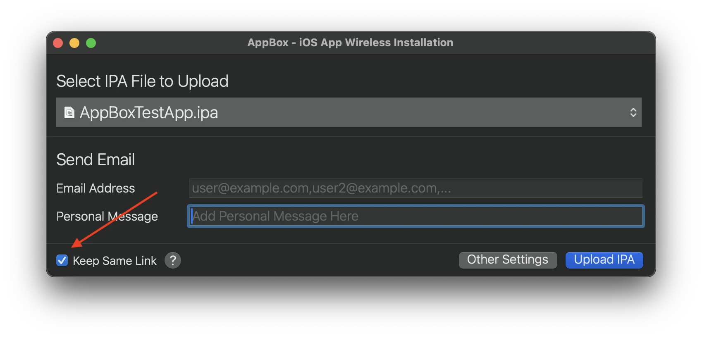
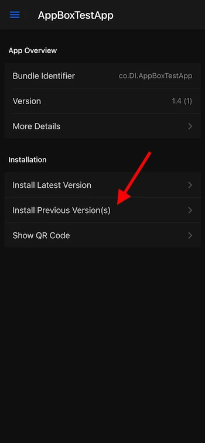
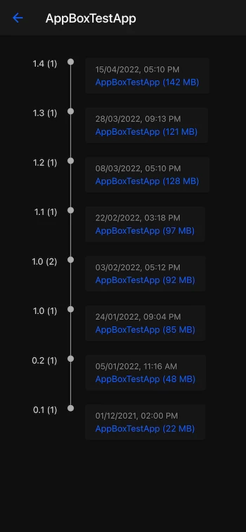
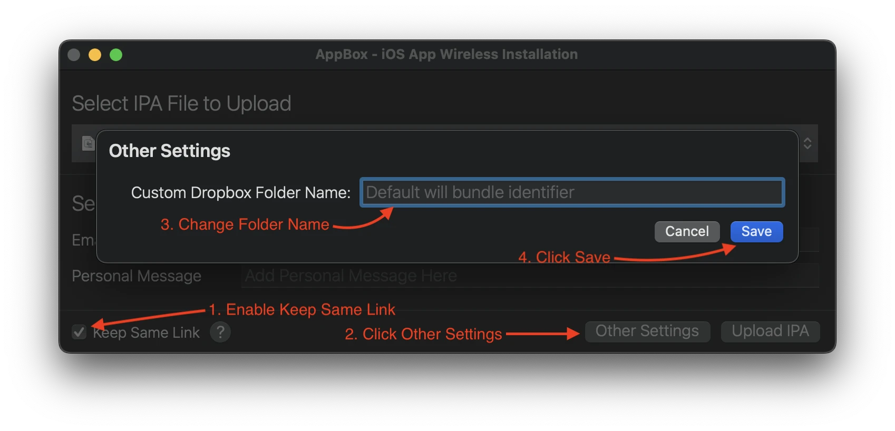
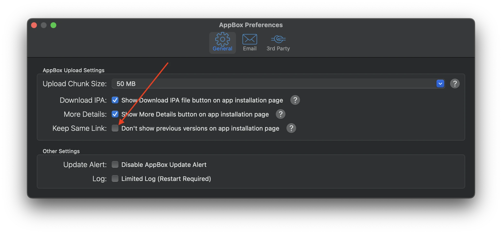

---
hide:
  - toc
---

# Keep Same Link
## 1. What is keep same link?
This feature maintains the same short URL for all future builds/IPAs uploaded with the same bundle identifier. When enabled, you can also download previous builds using the same URL.

When you've uploaded multiple builds/IPAs for an app with the "Keep Same Link" option enabled and open the short URL on your iOS device, you'll see two options available

#### 1.1. Install Latest Version
The "Install Latest Version" button always installs the latest build

#### 1.2. Install Previous Version(s)
The "Install Previous Version(s)" button opens a new page showing a list of all uploaded versions with their respective dates and times (based on the device's local time). You can install any previous build from this page.

  

## 2. How to Create Two Different Links for the Same Build with the "Keep Same Link" Option?
You can modify the link by specifying a unique "Custom Dropbox Folder Name" in the "Other Settings" section. By default, the folder name is set to the application's bundle identifier, and AppBox uses the same link for IPA files within that folder. To create distinct links for the same build, assign different custom folder names for each link.

## 3. How to Maintain the Same Link While Hiding Previous Versions on the Installation Page?
In AppBox preferences, enable the "Don't show previous versions on app installation page" option. When both this option and the "Keep Same Link" feature are enabled during upload, the AppBox installation page will not display previous versions.
