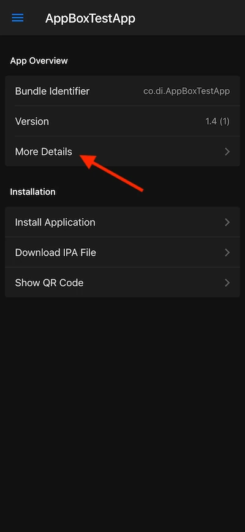
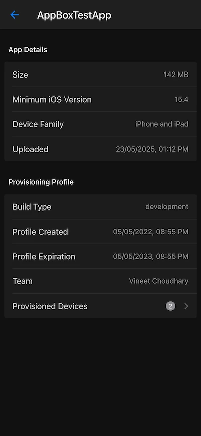
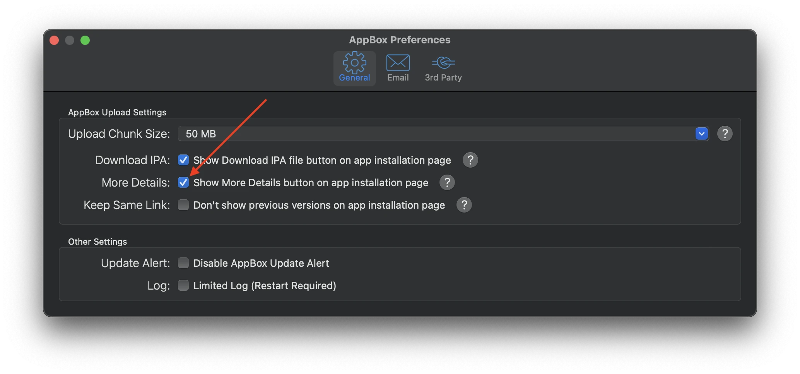

---
hide:
  - toc
---

# View Application Details on the AppBox Installation Web Page
This feature adds an extra option to the AppBox installation page for your iOS application, displaying details such as IPA file size, minimum iOS version, device family, upload date, provisioning profile type, provisioning profile creation date, provisioning profile expiration date, development team, and provisioned devices.

    

You can enable or disable this feature in AppBox general preferences.

