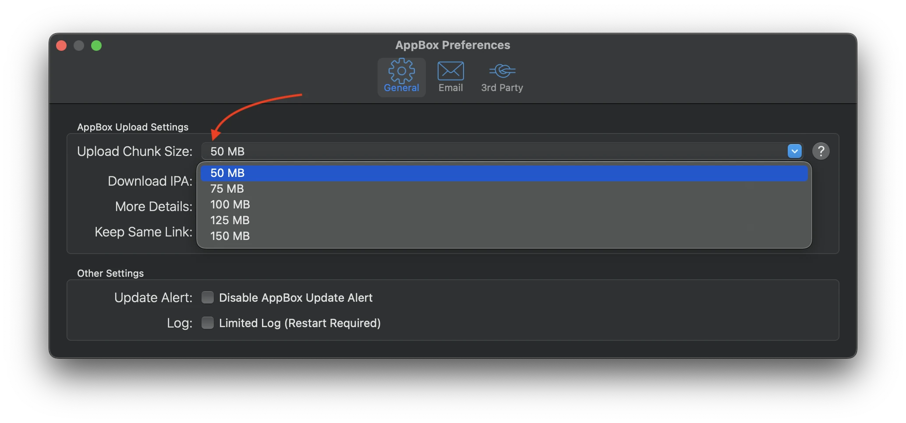

---
hide:
  - toc
---
# Upload Chunk Size
Chunk size is used to upload your large IPA file in the chunk. Default chunk size is 100MB, means AppBox will upload an IPA file with 100MB partitions. You can set chunk size from AppBox Preferences (⌘ + ,).

#### Examples -
150 MB means, If you'll try to upload a 2GB IPA then AppBox will break IPA into 14 part and upload them separately

`2GB = 2048MB`
`2048/150 = 13.65 ~= 14`
Now AppBox will break 2 GB IPA into 14 part and here 13 part will be equally separated into 150MB and last part will be the size of 98MB

`(13 * 150) + 98 = 2048MB = 2GB`

Similarly, if you'll select 100MB chunk size in preferences, AppBox will break 2GB (2048MB) IPA file into 21 part

`2GB = 2048MB`
`2048/100 = 20.48 ~= 21`
here 20 part will be equally separated into 100MB and last part will be the size of 48MB

`(20 * 100) + 48 = 2048 MB = 2GB`